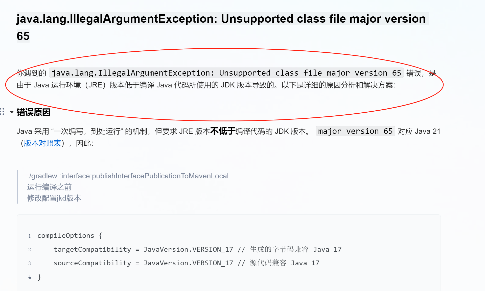

# 编译环境说明
  jkd-17
  Android Studio Meerkat | 2024.3.1

# github上fork出来的是使用jkd21
 由于lsposed-v1.9.2采用采用jdk17编译，所以一定要注意不能采用jdk21编译
 

# 编译lpsoed之前需要编译并发布到本地仓库
~~~
拉取libxposed
git clone --depth 1 https://github.com/libxposed/api.git libxposed/api
git clone --depth 1 https://github.com/libxposed/service.git libxposed/service
#编译并发布到本地仓库
cd libxposed/api
./gradlew :api:publishApiPublicationToMavenLocal
cd ../service
#需要JetBrains-21.0.7--改为jkd17，否则在lsposed项目中将无法使用
./gradlew :interface:publishInterfacePublicationToMavenLocal

./gradlew :service:publishServicePublicationToMavenLocal
cd ../../
./gradlew zipAll

~~~
